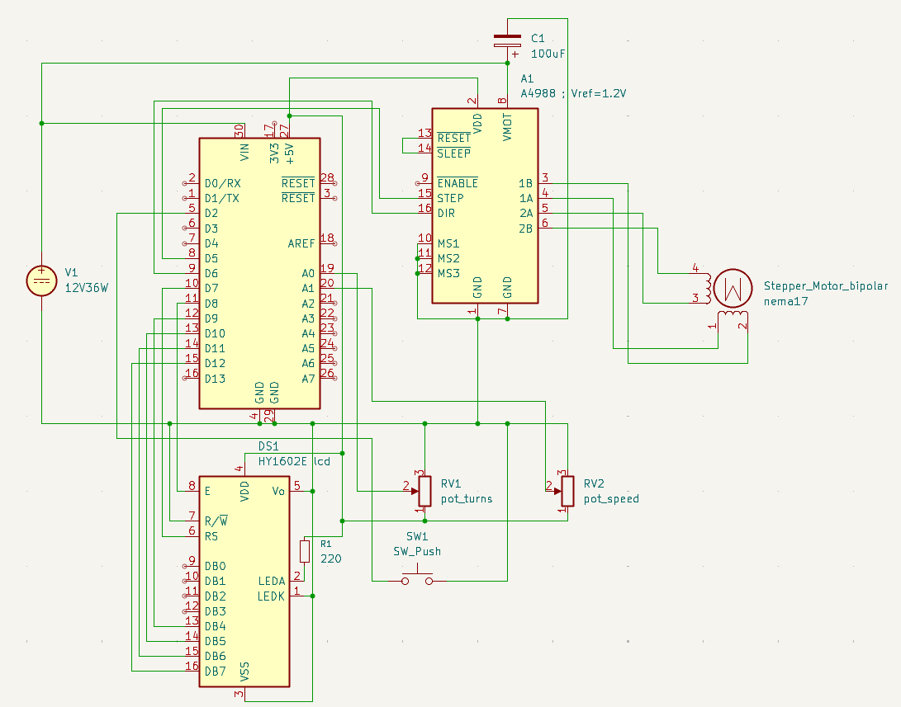

# STRATEC Biomedical hardware challenge

## Assignment
As understood, lcd displays current position, desired number of turns ( with decimal accuracy ), angular velocity, and ON/OFF state for movement activated by a button press. The two potentiometers address the number of turns (displayed) and the step delay, therefore adjusting the velocity (not displayed, too cramped).

| Component | Part |
| - | - |
| Microcontroller | Arduino nano |
| Motor | Nema 17 Stepper |
| Supply | generic 12v36W |
| Driver | A4988 |
| Display | HY1602E LCD |
| Auxiliary | Generic button, 2x potentiometer |

## Schematic

